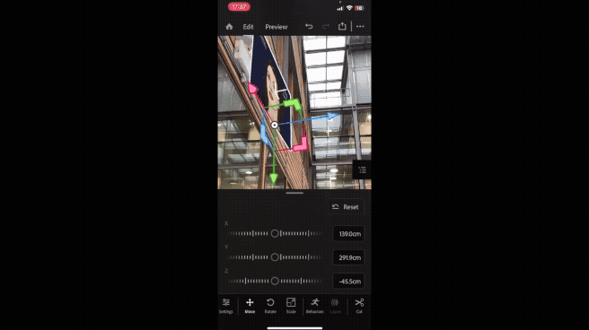

# MixedReality

# 🌀 Mixed Reality: *Notting Nights*

**When the lights go out, the lab wakes up.**

Welcome to , a mixed reality experience built in the University's Computer Science lab, where history and technology collide.

---

#  Generative AI talking images 
 

---

## ✨ Features

* **Generative AI Characters** – Posters of pioneers like Turing and Lovelace come alive with voices, gestures, and unique personalities.
* **Artefact Animations** – School artefacts (old terminals, books, vintage computers) start moving, speaking, and interacting with the environment.
* **GPS Triggers** – Players move across campus, and real-world locations trigger in-game events, dialogues, and encounters.
* **Night-Mode Narrative** – The experience only activates in the *after-dark* setting, immersing players in a “hidden world” on familiar ground.

---

## 🎮 Gameplay Loop

1. **Explore the Campus** – Walk around the University of  CS lab and surrounding areas.
2. **Trigger Encounters** – GPS markers activate hidden events.
3. **Interact with Characters** – Talk to pioneers, learn computing history, or join their adventures.
4. **Collect & Discover** – Gather artefacts, solve puzzles, and unlock stories.

---

## 🛠️ Tech Stack

* **Unity + AR Foundation** for the mixed-reality environment
* **GPS & Geofencing** for location-based triggers
* **Generative AI APIs** for character dialogue and animation
* **3D Assets & AR Markers** to animate posters and artefacts

---

## 🌌 Vision

The MVP is just the beginning. The long-term vision is to transform **universities, museums, and campuses** into living playgrounds where history and technology fuse—turning education into an adventure.

Imagine:

* Meeting Alan Turing as he explains cryptography while sprinting across the atrium.
* Having Ada Lovelace challenge you to solve a coding puzzle before she disappears.
* Watching artefacts like vintage punch cards and mainframe consoles come alive to tell their stories.

---

## 🚀 Next Steps

* Expand character roster (other pioneers & cultural icons)
* Add multiplayer experiences
* Integrate AR puzzles and minigames
* Connect with real course material for **edutainment**

---

## 📍 About

Built in the ** Computer Science Lab** as a creative experiment in **mixed reality + generative AI**, this MVP blends **gaming, education, and storytelling** into a surreal night-time adventure.

> “By day, we study history. By night, history studies us.”

